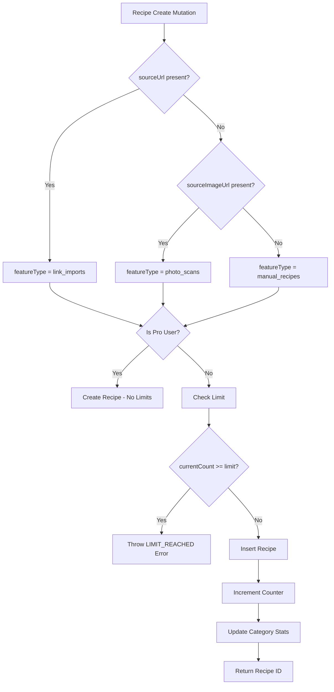

# Rate Limiting System Analysis - Cookly App

## Executive Summary

**Critical Bug Identified:** There is a desynchronization between frontend and backend limit values:
- **Frontend displays:** 100 for all limits (link_imports, photo_scans, manual_recipes)
- **Backend enforces:** 50 for link_imports and photo_scans, 100 for manual_recipes

This causes users to see "50/100" in the UI but get blocked when they reach 50.

---

## 1. Limit Definitions - Location Analysis

### 1.1 Frontend Limits (Source of Truth for Display)

**File:** `convex/users.ts` (lines 7-11)

```typescript
const FREE_LIMITS = {
  MANUAL_RECIPES: 100,    // ANPASSUNG HIER: Manuell erstellte Rezepte Limit
  LINK_IMPORTS: 100,      // ANPASSUNG HIER: URL/Instagram Imports Limit
  PHOTO_SCANS: 100,       // ANPASSUNG HIER: KI Foto-Scans Limit
};
```

These values are used by:
- `canCreateManualRecipe()` (lines 41-79) - query for frontend checks
- `canImportFromLink()` (lines 86-124) - query for frontend checks  
- `canScanPhoto()` (lines 131-169) - query for frontend checks
- `getUsageStats()` (lines 175-199) - legacy query for ProfilePage

### 1.2 Backend Limits (Source of Truth for Enforcement)

**File:** `convex/recipes.ts` (lines 375-388)

```typescript
switch (featureType) {
  case "manual_recipes":
    currentCount = stats.manualRecipes || 0;
    limit = 100; // FREE_LIMITS.MANUAL_RECIPES
    break;
  case "link_imports":
    currentCount = stats.linkImports || 0;
    limit = 50; // FREE_LIMITS.LINK_IMPORTS  <-- HARDCODED 50!
    break;
  case "photo_scans":
    currentCount = stats.photoScans || 0;
    limit = 50; // FREE_LIMITS.PHOTO_SCANS   <-- HARDCODED 50!
    break;
}
```

### 1.3 Schema Documentation

**File:** `convex/schema.ts` (lines 37-39)

```typescript
usageStats: v.object({
  manualRecipes: v.optional(v.number()),      // Manuell erstellte Rezepte (Limit: 100)
  linkImports: v.optional(v.number()),        // URL/Instagram Imports (Limit: 50)
  photoScans: v.optional(v.number()),         // KI Foto-Scans (Limit: 50)
```

---

## 2. Usage Tracking System

### 2.1 Database Schema

**File:** `convex/schema.ts` (lines 35-52)

```typescript
usageStats: v.object({
  // Separate Counter (Lifetime, kein Reset für Free Tier)
  manualRecipes: v.optional(v.number()),      // Manuell erstellte Rezepte
  linkImports: v.optional(v.number()),        // URL/Instagram Imports
  photoScans: v.optional(v.number()),         // KI Foto-Scans

  // Subscription Zeiträume (für Pro Tier)
  subscriptionStartDate: v.optional(v.number()),
  subscriptionEndDate: v.optional(v.number()),

  // Reset flag für Downgrade
  resetOnDowngrade: v.optional(v.boolean()),

  // OLD: Deprecated fields (for migration compatibility)
  importedRecipes: v.optional(v.number()),
  importsLastReset: v.optional(v.number()),
  weeklyPlansActive: v.optional(v.number()),
})
```

### 2.2 Counter Increment Logic

**File:** `convex/users.ts` (lines 440-499)

The `incrementUsageCounter` internal mutation handles counter updates:
- Only increments for free tier users (Pro users skip)
- Increments AFTER successful recipe insert
- Uses separate counters for each feature type

---

## 3. Limit Check Flow

### 3.1 Feature Type Determination

**File:** `convex/recipes.ts` (lines 321-335)

```typescript
let featureType: "manual_recipes" | "link_imports" | "photo_scans";

if (args.sourceUrl) {
  // URL vorhanden = Link Import (Instagram/Website)
  featureType = "link_imports";
} else if (args.sourceImageUrl) {
  // sourceImageUrl vorhanden = Foto Scan
  featureType = "photo_scans";
} else {
  // Sonst = Manuelles Rezept
  featureType = "manual_recipes";
}
```

### 3.2 Complete Limit Check Flow

```
Recipe Create Mutation
        │
        ▼
┌─────────────────────┐
│ sourceUrl present?  │
└─────────────────────┘
        │
   ┌────┴────┐
   │         │
  Yes       No
   │         │
   ▼         ▼
link_imports ┌─────────────────────┐
             │ sourceImageUrl present?│
             └─────────────────────┘
                     │
                ┌────┴────┐
                │         │
               Yes       No
                │         │
                ▼         ▼
           photo_scans  manual_recipes
                │         │
                └────┬────┘
                     │
                     ▼
           ┌─────────────────────┐
           │  Is Pro User?       │
           └─────────────────────┘
                     │
                ┌────┴────┐
                │         │
               Yes       No
                │         │
                ▼         ▼
         Create Recipe  Check Limit
         (No limits)        │
                            ▼
                   ┌─────────────────────┐
                   │ currentCount >= limit?│
                   └─────────────────────┘
                            │
                       ┌────┴────┐
                       │         │
                      Yes       No
                       │         │
                       ▼         ▼
              Throw LIMIT_REACHED  Insert Recipe
              Error                     │
                                        ▼
                                  Increment Counter
                                        │
                                        ▼
                                  Update Category Stats
                                        │
                                        ▼
                                  Return Recipe ID
```

### 3.3 Error Structure When Limit Reached

**File:** `convex/recipes.ts` (lines 390-400)

```typescript
if (currentCount >= limit) {
  const errorData = {
    type: "LIMIT_REACHED",
    feature: featureType,
    current: currentCount,
    limit: limit,
    message: getLimitMessage(featureType, limit),
  };
  throw new Error(JSON.stringify(errorData));
}
```

---

## 4. Import Flow by Source

### 4.1 Instagram Import

**File:** `convex/instagram.ts` (lines 38-333)

Flow:
1. Authentication check
2. Rate limiting check (10 requests/minute via `rateLimiter.ts`)
3. URL validation
4. Duplicate check via `recipes.getBySourceUrl`
5. Import lock acquisition
6. Apify API call for post data
7. Gemini AI parsing
8. Image handling with Pollinations fallback
9. **Calls `recipes.create` mutation** - limit checked here
10. Releases import lock

### 4.2 Facebook Import

**File:** `convex/facebook.ts` (lines 1-434)

Same flow as Instagram - ultimately calls `recipes.create` mutation.

### 4.3 Website Import

Would follow similar pattern - calls `recipes.create` with `sourceUrl` set.

---

## 5. The Discrepancy - Root Cause

### Problem Summary Table

| Feature | Frontend Limit | Backend Limit | Mismatch |
|---------|---------------|---------------|----------|
| manual_recipes | 100 | 100 | Match |
| link_imports | 100 | 50 | **MISMATCH** |
| photo_scans | 100 | 50 | **MISMATCH** |

### Code Evidence

**Frontend Query (users.ts line 113):**
```typescript
const limit = FREE_LIMITS.LINK_IMPORTS;  // = 100
```

**Backend Enforcement (recipes.ts line 382):**
```typescript
limit = 50; // FREE_LIMITS.LINK_IMPORTS  <-- Comment says FREE_LIMITS but value is 50!
```

The comments in `recipes.ts` (lines 382-386) reference `FREE_LIMITS.LINK_IMPORTS` and `FREE_LIMITS.PHOTO_SCANS` but the actual values are hardcoded to 50, not using the constant.

---

## 6. All Limit Types

### 6.1 Feature Limits (Usage Quotas)

| Type | Counter Field | Current Backend Limit | Frontend Display |
|------|--------------|----------------------|------------------|
| `manual_recipes` | `usageStats.manualRecipes` | 100 | 100 |
| `link_imports` | `usageStats.linkImports` | 50 | 100 |
| `photo_scans` | `usageStats.photoScans` | 50 | 100 |

### 6.2 Rate Limiting (API Protection)

**File:** `convex/rateLimiter.ts` (lines 16-19)

```typescript
const RATE_LIMIT = {
  MAX_REQUESTS_PER_MINUTE: 10,
  WINDOW_MS: 60 * 1000, // 1 Minute
};
```

This is a **separate** rate limiting system for API spam protection, not usage quotas. It uses in-memory storage per function instance.

---

## 7. Pro User Handling

Pro users (subscription !== "free") bypass all limits:

1. **In limit checks:** `recipes.ts` lines 352-358 - Pro users skip limit check entirely
2. **In counter increment:** `users.ts` lines 460-462 - Counter not incremented for Pro

---

## 8. Recommendations

### Fix Option 1: Use Constants in Backend (Recommended)

Import and use `FREE_LIMITS` from users.ts in recipes.ts:

```typescript
// In recipes.ts
import { FREE_LIMITS } from "./users";

// Then use:
limit = FREE_LIMITS.LINK_IMPORTS;
limit = FREE_LIMITS.PHOTO_SCANS;
limit = FREE_LIMITS.MANUAL_RECIPES;
```

### Fix Option 2: Create Shared Constants File

Create a new file `convex/constants.ts`:

```typescript
export const FREE_LIMITS = {
  MANUAL_RECIPES: 100,
  LINK_IMPORTS: 100,
  PHOTO_SCANS: 100,
} as const;
```

Import in both `users.ts` and `recipes.ts`.

### Fix Option 3: Align Backend to 50

If 50 is the intended limit, update `users.ts`:

```typescript
const FREE_LIMITS = {
  MANUAL_RECIPES: 100,
  LINK_IMPORTS: 50,
  PHOTO_SCANS: 50,
};
```

---

## 9. File Reference Summary

| File | Purpose | Lines of Interest |
|------|---------|------------------|
| `convex/users.ts` | Frontend limit queries, counter increment | 7-11, 41-199, 440-499 |
| `convex/recipes.ts` | Backend limit enforcement, create mutation | 287-428 |
| `convex/schema.ts` | Database schema for usageStats | 35-52 |
| `convex/rateLimiter.ts` | API rate limiting (10 req/min) | 1-109 |
| `convex/instagram.ts` | Instagram import flow | 38-333 |
| `convex/facebook.ts` | Facebook import flow | 1-434 |

## Executive Summary

**Critical Bug Identified:** There is a desynchronization between frontend and backend limit values:
- **Frontend displays:** 100 for all limits (link_imports, photo_scans, manual_recipes)
- **Backend enforces:** 50 for link_imports and photo_scans, 100 for manual_recipes

This causes users to see "50/100" in the UI but get blocked when they reach 50.

---

## 1. Limit Definitions - Location Analysis

### 1.1 Frontend Limits (Source of Truth for Display)

**File:** `convex/users.ts` (lines 7-11)

```typescript
const FREE_LIMITS = {
  MANUAL_RECIPES: 100,    // ANPASSUNG HIER: Manuell erstellte Rezepte Limit
  LINK_IMPORTS: 100,      // ANPASSUNG HIER: URL/Instagram Imports Limit
  PHOTO_SCANS: 100,       // ANPASSUNG HIER: KI Foto-Scans Limit
};
```

These values are used by:
- `canCreateManualRecipe()` (lines 41-79) - query for frontend checks
- `canImportFromLink()` (lines 86-124) - query for frontend checks  
- `canScanPhoto()` (lines 131-169) - query for frontend checks
- `getUsageStats()` (lines 175-199) - legacy query for ProfilePage

### 1.2 Backend Limits (Source of Truth for Enforcement)

**File:** `convex/recipes.ts` (lines 375-388)

```typescript
switch (featureType) {
  case "manual_recipes":
    currentCount = stats.manualRecipes || 0;
    limit = 100; // FREE_LIMITS.MANUAL_RECIPES
    break;
  case "link_imports":
    currentCount = stats.linkImports || 0;
    limit = 50; // FREE_LIMITS.LINK_IMPORTS  <-- HARDCODED 50!
    break;
  case "photo_scans":
    currentCount = stats.photoScans || 0;
    limit = 50; // FREE_LIMITS.PHOTO_SCANS   <-- HARDCODED 50!
    break;
}
```

### 1.3 Schema Documentation

**File:** `convex/schema.ts` (lines 37-39)

```typescript
usageStats: v.object({
  manualRecipes: v.optional(v.number()),      // Manuell erstellte Rezepte (Limit: 100)
  linkImports: v.optional(v.number()),        // URL/Instagram Imports (Limit: 50)
  photoScans: v.optional(v.number()),         // KI Foto-Scans (Limit: 50)
```

---

## 2. Usage Tracking System

### 2.1 Database Schema

**File:** `convex/schema.ts` (lines 35-52)

```typescript
usageStats: v.object({
  // Separate Counter (Lifetime, kein Reset für Free Tier)
  manualRecipes: v.optional(v.number()),      // Manuell erstellte Rezepte
  linkImports: v.optional(v.number()),        // URL/Instagram Imports
  photoScans: v.optional(v.number()),         // KI Foto-Scans

  // Subscription Zeiträume (für Pro Tier)
  subscriptionStartDate: v.optional(v.number()),
  subscriptionEndDate: v.optional(v.number()),

  // Reset flag für Downgrade
  resetOnDowngrade: v.optional(v.boolean()),

  // OLD: Deprecated fields (for migration compatibility)
  importedRecipes: v.optional(v.number()),
  importsLastReset: v.optional(v.number()),
  weeklyPlansActive: v.optional(v.number()),
})
```

### 2.2 Counter Increment Logic

**File:** `convex/users.ts` (lines 440-499)

The `incrementUsageCounter` internal mutation handles counter updates:
- Only increments for free tier users (Pro users skip)
- Increments AFTER successful recipe insert
- Uses separate counters for each feature type

---

## 3. Limit Check Flow

### 3.1 Feature Type Determination

**File:** `convex/recipes.ts` (lines 321-335)

```typescript
let featureType: "manual_recipes" | "link_imports" | "photo_scans";

if (args.sourceUrl) {
  // URL vorhanden = Link Import (Instagram/Website)
  featureType = "link_imports";
} else if (args.sourceImageUrl) {
  // sourceImageUrl vorhanden = Foto Scan
  featureType = "photo_scans";
} else {
  // Sonst = Manuelles Rezept
  featureType = "manual_recipes";
}
```

### 3.2 Complete Limit Check Flow

```
Recipe Create Mutation
        │
        ▼
┌─────────────────────┐
│ sourceUrl present?  │
└─────────────────────┘
        │
   ┌────┴────┐
   │         │
  Yes       No
   │         │
   ▼         ▼
link_imports ┌─────────────────────┐
             │ sourceImageUrl present?│
             └─────────────────────┘
                     │
                ┌────┴────┐
                │         │
               Yes       No
                │         │
                ▼         ▼
           photo_scans  manual_recipes
                │         │
                └────┬────┘
                     │
                     ▼
           ┌─────────────────────┐
           │  Is Pro User?       │
           └─────────────────────┘
                     │
                ┌────┴────┐
                │         │
               Yes       No
                │         │
                ▼         ▼
         Create Recipe  Check Limit
         (No limits)        │
                            ▼
                   ┌─────────────────────┐
                   │ currentCount >= limit?│
                   └─────────────────────┘
                            │
                       ┌────┴────┐
                       │         │
                      Yes       No
                       │         │
                       ▼         ▼
              Throw LIMIT_REACHED  Insert Recipe
              Error                     │
                                        ▼
                                  Increment Counter
                                        │
                                        ▼
                                  Update Category Stats
                                        │
                                        ▼
                                  Return Recipe ID
```

### 3.3 Error Structure When Limit Reached

**File:** `convex/recipes.ts` (lines 390-400)

```typescript
if (currentCount >= limit) {
  const errorData = {
    type: "LIMIT_REACHED",
    feature: featureType,
    current: currentCount,
    limit: limit,
    message: getLimitMessage(featureType, limit),
  };
  throw new Error(JSON.stringify(errorData));
}
```

---

## 4. Import Flow by Source

### 4.1 Instagram Import

**File:** `convex/instagram.ts` (lines 38-333)

Flow:
1. Authentication check
2. Rate limiting check (10 requests/minute via `rateLimiter.ts`)
3. URL validation
4. Duplicate check via `recipes.getBySourceUrl`
5. Import lock acquisition
6. Apify API call for post data
7. Gemini AI parsing
8. Image handling with Pollinations fallback
9. **Calls `recipes.create` mutation** - limit checked here
10. Releases import lock

### 4.2 Facebook Import

**File:** `convex/facebook.ts` (lines 1-434)

Same flow as Instagram - ultimately calls `recipes.create` mutation.

### 4.3 Website Import

Would follow similar pattern - calls `recipes.create` with `sourceUrl` set.

---

## 5. The Discrepancy - Root Cause

### Problem Summary Table

| Feature | Frontend Limit | Backend Limit | Mismatch |
|---------|---------------|---------------|----------|
| manual_recipes | 100 | 100 | Match |
| link_imports | 100 | 50 | **MISMATCH** |
| photo_scans | 100 | 50 | **MISMATCH** |

### Code Evidence

**Frontend Query (users.ts line 113):**
```typescript
const limit = FREE_LIMITS.LINK_IMPORTS;  // = 100
```

**Backend Enforcement (recipes.ts line 382):**
```typescript
limit = 50; // FREE_LIMITS.LINK_IMPORTS  <-- Comment says FREE_LIMITS but value is 50!
```

The comments in `recipes.ts` (lines 382-386) reference `FREE_LIMITS.LINK_IMPORTS` and `FREE_LIMITS.PHOTO_SCANS` but the actual values are hardcoded to 50, not using the constant.

---

## 6. All Limit Types

### 6.1 Feature Limits (Usage Quotas)

| Type | Counter Field | Current Backend Limit | Frontend Display |
|------|--------------|----------------------|------------------|
| `manual_recipes` | `usageStats.manualRecipes` | 100 | 100 |
| `link_imports` | `usageStats.linkImports` | 50 | 100 |
| `photo_scans` | `usageStats.photoScans` | 50 | 100 |

### 6.2 Rate Limiting (API Protection)

**File:** `convex/rateLimiter.ts` (lines 16-19)

```typescript
const RATE_LIMIT = {
  MAX_REQUESTS_PER_MINUTE: 10,
  WINDOW_MS: 60 * 1000, // 1 Minute
};
```

This is a **separate** rate limiting system for API spam protection, not usage quotas. It uses in-memory storage per function instance.

---

## 7. Pro User Handling

Pro users (subscription !== "free") bypass all limits:

1. **In limit checks:** `recipes.ts` lines 352-358 - Pro users skip limit check entirely
2. **In counter increment:** `users.ts` lines 460-462 - Counter not incremented for Pro

---

## 8. Recommendations

### Fix Option 1: Use Constants in Backend (Recommended)

Import and use `FREE_LIMITS` from users.ts in recipes.ts:

```typescript
// In recipes.ts
import { FREE_LIMITS } from "./users";

// Then use:
limit = FREE_LIMITS.LINK_IMPORTS;
limit = FREE_LIMITS.PHOTO_SCANS;
limit = FREE_LIMITS.MANUAL_RECIPES;
```

### Fix Option 2: Create Shared Constants File

Create a new file `convex/constants.ts`:

```typescript
export const FREE_LIMITS = {
  MANUAL_RECIPES: 100,
  LINK_IMPORTS: 100,
  PHOTO_SCANS: 100,
} as const;
```

Import in both `users.ts` and `recipes.ts`.

### Fix Option 3: Align Backend to 50

If 50 is the intended limit, update `users.ts`:

```typescript
const FREE_LIMITS = {
  MANUAL_RECIPES: 100,
  LINK_IMPORTS: 50,
  PHOTO_SCANS: 50,
};
```

---

## 9. File Reference Summary

| File | Purpose | Lines of Interest |
|------|---------|------------------|
| `convex/users.ts` | Frontend limit queries, counter increment | 7-11, 41-199, 440-499 |
| `convex/recipes.ts` | Backend limit enforcement, create mutation | 287-428 |
| `convex/schema.ts` | Database schema for usageStats | 35-52 |
| `convex/rateLimiter.ts` | API rate limiting (10 req/min) | 1-109 |
| `convex/instagram.ts` | Instagram import flow | 38-333 |
| `convex/facebook.ts` | Facebook import flow | 1-434 |

| [`convex/instagram.ts`](convex/instagram.ts) | Instagram import flow | 38-333 |
| [`convex/facebook.ts`](convex/facebook.ts) | Facebook import flow | 1-434 |

## Executive Summary

**Critical Bug Identified:** There is a desynchronization between frontend and backend limit values:
- **Frontend displays:** 100 for all limits (link_imports, photo_scans, manual_recipes)
- **Backend enforces:** 50 for link_imports and photo_scans, 100 for manual_recipes

This causes users to see "50/100" in the UI but get blocked when they reach 50.

---

## 1. Limit Definitions - Location Analysis

### 1.1 Frontend Limits (Source of Truth for Display)

**File:** [`convex/users.ts`](convex/users.ts:7-11)

```typescript
const FREE_LIMITS = {
  MANUAL_RECIPES: 100,    // ANPASSUNG HIER: Manuell erstellte Rezepte Limit
  LINK_IMPORTS: 100,      // ANPASSUNG HIER: URL/Instagram Imports Limit
  PHOTO_SCANS: 100,       // ANPASSUNG HIER: KI Foto-Scans Limit
};
```

These values are used by:
- [`canCreateManualRecipe()`](convex/users.ts:41-79) - query for frontend checks
- [`canImportFromLink()`](convex/users.ts:86-124) - query for frontend checks  
- [`canScanPhoto()`](convex/users.ts:131-169) - query for frontend checks
- [`getUsageStats()`](convex/users.ts:175-199) - legacy query for ProfilePage

### 1.2 Backend Limits (Source of Truth for Enforcement)

**File:** [`convex/recipes.ts`](convex/recipes.ts:375-388)

```typescript
switch (featureType) {
  case "manual_recipes":
    currentCount = stats.manualRecipes || 0;
    limit = 100; // FREE_LIMITS.MANUAL_RECIPES
    break;
  case "link_imports":
    currentCount = stats.linkImports || 0;
    limit = 50; // FREE_LIMITS.LINK_IMPORTS  <-- HARDCODED 50!
    break;
  case "photo_scans":
    currentCount = stats.photoScans || 0;
    limit = 50; // FREE_LIMITS.PHOTO_SCANS   <-- HARDCODED 50!
    break;
}
```

### 1.3 Schema Documentation

**File:** [`convex/schema.ts`](convex/schema.ts:37-39)

```typescript
usageStats: v.object({
  manualRecipes: v.optional(v.number()),      // Manuell erstellte Rezepte (Limit: 100)
  linkImports: v.optional(v.number()),        // URL/Instagram Imports (Limit: 50)
  photoScans: v.optional(v.number()),         // KI Foto-Scans (Limit: 50)
```

---

## 2. Usage Tracking System

### 2.1 Database Schema

**File:** [`convex/schema.ts`](convex/schema.ts:35-52)

```typescript
usageStats: v.object({
  // Separate Counter (Lifetime, kein Reset für Free Tier)
  manualRecipes: v.optional(v.number()),      // Manuell erstellte Rezepte
  linkImports: v.optional(v.number()),        // URL/Instagram Imports
  photoScans: v.optional(v.number()),         // KI Foto-Scans

  // Subscription Zeiträume (für Pro Tier)
  subscriptionStartDate: v.optional(v.number()),
  subscriptionEndDate: v.optional(v.number()),

  // Reset flag für Downgrade
  resetOnDowngrade: v.optional(v.boolean()),

  // OLD: Deprecated fields (for migration compatibility)
  importedRecipes: v.optional(v.number()),
  importsLastReset: v.optional(v.number()),
  weeklyPlansActive: v.optional(v.number()),
})
```

### 2.2 Counter Increment Logic

**File:** [`convex/users.ts`](convex/users.ts:440-499)

```typescript
export const incrementUsageCounter = internalMutation({
  args: {
    clerkId: v.string(),
    feature: v.union(
      v.literal("manual_recipes"),
      v.literal("link_imports"),
      v.literal("photo_scans")
    ),
  },
  handler: async (ctx, args) => {
    // ... user lookup ...
    
    // Pro User brauchen keine Counter
    if (user.subscription !== "free") {
      return;
    }

    switch (args.feature) {
      case "manual_recipes":
        updates.usageStats = {
          ...currentStats,
          manualRecipes: (currentStats.manualRecipes || 0) + 1,
        };
        break;
      case "link_imports":
        updates.usageStats = {
          ...currentStats,
          linkImports: (currentStats.linkImports || 0) + 1,
        };
        break;
      case "photo_scans":
        updates.usageStats = {
          ...currentStats,
          photoScans: (currentStats.photoScans || 0) + 1,
        };
        break;
    }
  },
});
```

---

## 3. Limit Check Flow

### 3.1 Feature Type Determination

**File:** [`convex/recipes.ts`](convex/recipes.ts:321-335)

```typescript
let featureType: "manual_recipes" | "link_imports" | "photo_scans";

if (args.sourceUrl) {
  // URL vorhanden = Link Import (Instagram/Website)
  featureType = "link_imports";
} else if (args.sourceImageUrl) {
  // sourceImageUrl vorhanden = Foto Scan
  featureType = "photo_scans";
} else {
  // Sonst = Manuelles Rezept
  featureType = "manual_recipes";
}
```

### 3.2 Complete Limit Check Flow



### 3.3 Error Structure When Limit Reached

**File:** [`convex/recipes.ts`](convex/recipes.ts:390-400)

```typescript
if (currentCount >= limit) {
  const errorData = {
    type: "LIMIT_REACHED",
    feature: featureType,
    current: currentCount,
    limit: limit,
    message: getLimitMessage(featureType, limit),
  };
  throw new Error(JSON.stringify(errorData));
}
```

---

## 4. Import Flow by Source

### 4.1 Instagram Import

**File:** [`convex/instagram.ts`](convex/instagram.ts:38-333)

Flow:
1. Authentication check
2. Rate limiting check (10 requests/minute via [`rateLimiter.ts`](convex/rateLimiter.ts))
3. URL validation
4. Duplicate check via [`recipes.getBySourceUrl`](convex/recipes.ts)
5. Import lock acquisition
6. Apify API call for post data
7. Gemini AI parsing
8. Image handling with Pollinations fallback
9. **Calls [`recipes.create`](convex/recipes.ts:287) mutation** - limit checked here
10. Releases import lock

### 4.2 Facebook Import

**File:** [`convex/facebook.ts`](convex/facebook.ts:1-434)

Same flow as Instagram - ultimately calls [`recipes.create`](convex/recipes.ts:287) mutation.

### 4.3 Website Import

Would follow similar pattern - calls [`recipes.create`](convex/recipes.ts:287) with `sourceUrl` set.

---

## 5. The Discrepancy - Root Cause

### Problem Summary Table

| Feature | Frontend Limit | Backend Limit | Mismatch |
|---------|---------------|---------------|----------|
| manual_recipes | 100 | 100 | ✅ Match |
| link_imports | 100 | 50 | ❌ **Mismatch** |
| photo_scans | 100 | 50 | ❌ **Mismatch** |

### Code Evidence

**Frontend Query (users.ts):**
```typescript
// Line 113
const limit = FREE_LIMITS.LINK_IMPORTS;  // = 100
```

**Backend Enforcement (recipes.ts):**
```typescript
// Line 382
limit = 50; // FREE_LIMITS.LINK_IMPORTS  <-- Comment says FREE_LIMITS but value is 50!
```

The comments in [`recipes.ts`](convex/recipes.ts:382-386) reference `FREE_LIMITS.LINK_IMPORTS` and `FREE_LIMITS.PHOTO_SCANS` but the actual values are hardcoded to 50, not using the constant.

---

## 6. All Limit Types

### 6.1 Feature Limits (Usage Quotas)

| Type | Counter Field | Current Backend Limit | Frontend Display |
|------|--------------|----------------------|------------------|
| `manual_recipes` | `usageStats.manualRecipes` | 100 | 100 |
| `link_imports` | `usageStats.linkImports` | 50 | 100 |
| `photo_scans` | `usageStats.photoScans` | 50 | 100 |

### 6.2 Rate Limiting (API Protection)

**File:** [`convex/rateLimiter.ts`](convex/rateLimiter.ts:16-19)

```typescript
const RATE_LIMIT = {
  MAX_REQUESTS_PER_MINUTE: 10,
  WINDOW_MS: 60 * 1000, // 1 Minute
};
```

This is a **separate** rate limiting system for API spam protection, not usage quotas. It uses in-memory storage per function instance.

---

## 7. Pro User Handling

Pro users (subscription !== "free") bypass all limits:

1. **In limit checks:** [`recipes.ts:352-358`](convex/recipes.ts:352-358) - Pro users skip limit check entirely
2. **In counter increment:** [`users.ts:460-462`](convex/users.ts:460-462) - Counter not incremented for Pro

---

## 8. Recommendations

### Fix Option 1: Use Constants in Backend (Recommended)

Import and use `FREE_LIMITS` from users.ts in recipes.ts:

```typescript
// In recipes.ts
import { FREE_LIMITS } from "./users";

// Then use:
limit = FREE_LIMITS.LINK_IMPORTS;
limit = FREE_LIMITS.PHOTO_SCANS;
limit = FREE_LIMITS.MANUAL_RECIPES;
```

### Fix Option 2: Create Shared Constants File

Create a new file `convex/constants.ts`:

```typescript
export const FREE_LIMITS = {
  MANUAL_RECIPES: 100,
  LINK_IMPORTS: 100,
  PHOTO_SCANS: 100,
} as const;
```

Import in both `users.ts` and `recipes.ts`.

### Fix Option 3: Align Backend to 50

If 50 is the intended limit, update `users.ts`:

```typescript
const FREE_LIMITS = {
  MANUAL_RECIPES: 100,
  LINK_IMPORTS: 50,
  PHOTO_SCANS: 50,
};
```

---

## 9. File Reference Summary

| File | Purpose | Lines of Interest |
|------|---------|------------------|
| [`convex/users.ts`](convex/users.ts) | Frontend limit queries, counter increment | 7-11, 41-199, 440-499 |
| [`convex/recipes.ts`](convex/recipes.ts) | Backend limit enforcement, create mutation | 287-428 |
| [`convex/schema.ts`](convex/schema.ts) | Database schema for usageStats | 35-52 |
| [`convex/rateLimiter.ts`](convex/rateLimiter.ts) | API rate limiting (10 req/min) | 1-109 |
| [`convex/instagram.ts`](convex/instagram.ts) | Instagram import flow | 38-333 |
| [`convex/facebook.ts`](convex/facebook.ts) | Facebook import flow | 1-434 |

