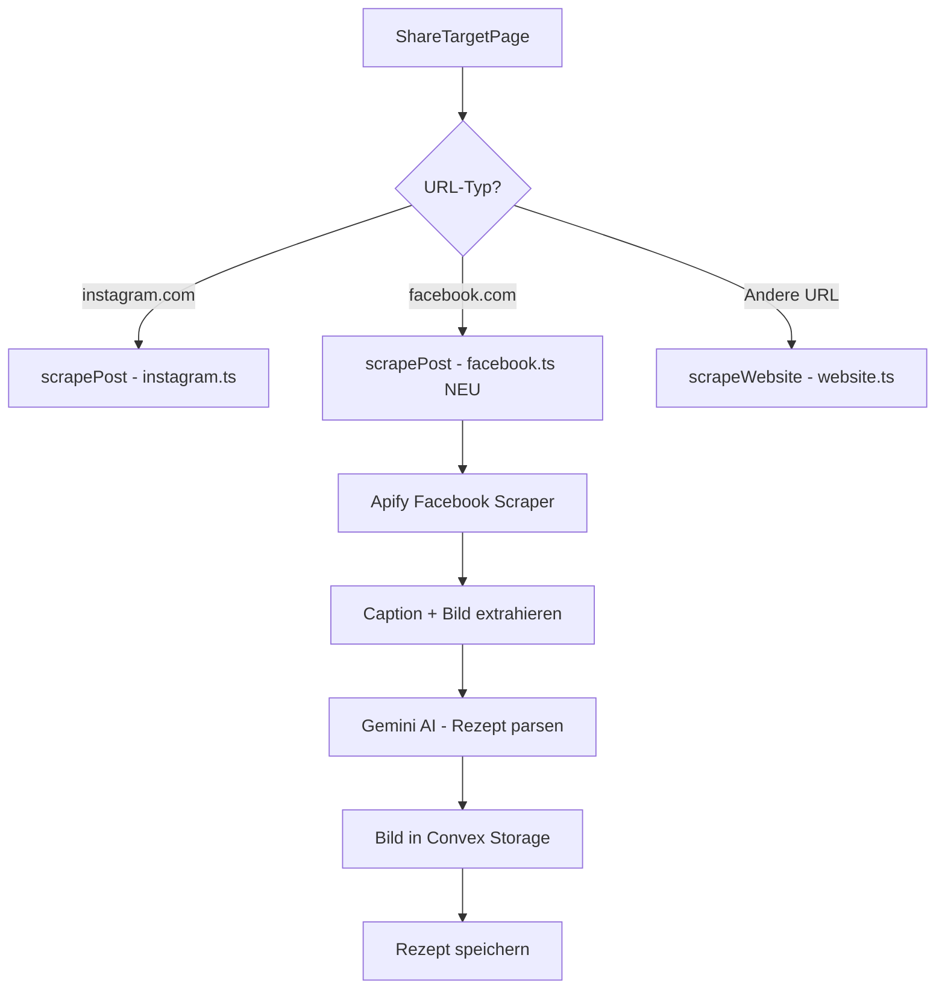

# Facebook Import Feature - Implementierungsplan

## Übersicht

Implementierung eines Facebook-Import-Features analog zum bestehenden Instagram-Workflow, unter Verwendung des **Apify Facebook Posts Scraper** (`apify/facebook-posts-scraper`).

## Architektur



## Dateien zu erstellen/ändern

### 1. Neue Datei: `convex/facebook.ts`

Analog zu [`convex/instagram.ts`](../convex/instagram.ts:38)

**Struktur:**
- **Zeile 1-36**: Imports und Prompt (identisch zu Instagram)
- **Zeile 38-167**: `scrapePost` Action mit:
  - Auth + Rate Limiting
  - URL Validation für Facebook
  - Apify Facebook Scraper Call
  - Bild-Extraktion aus `media[0].thumbnail` oder `media[0].photo_image.uri`
  - Gemini AI Parsing
  - Image Storage
  - Recipe Create

**Bild-Extraktion Logik:**
```typescript
// Aus Apify Response:
// media[0].thumbnail - Für Videos/Reels
// media[0].photo_image.uri - Für Photos (höhere Auflösung)
let imageUrl = '';
if (post.media && post.media.length > 0) {
    const media = post.media[0];
    // Prefer photo_image.uri for higher quality, fallback to thumbnail
    imageUrl = media.photo_image?.uri || media.thumbnail || '';
}
```

### 2. Änderung: `pages/ShareTargetPage.tsx`

**Zeile 14**: Neuen Action Import hinzufügen:
```typescript
const scrapeFacebookPost = useAction(api.facebook.scrapePost);
```

**Zeile 81**: Facebook URL-Matching hinzufügen:
```typescript
const facebookMatch = combinedText.match(/facebook\.com\/(watch|reel|.*\/posts|.*\/videos)\/([A-Za-z0-9_-]+)/);
```

**Zeile 85-105**: Facebook-Handling hinzufügen (nach Instagram, vor genericUrl):
```typescript
if (instagramMatch) {
    // ... existing code
} else if (facebookMatch) {
    // Extrahiere saubere Facebook URL
    const fbUrl = genericUrlMatch?.[1] || '';
    console.log(`[ShareTarget] #${shareRunId} facebookMatch`, { fbUrl });
    setStatus('analyzing');
    
    setPhase('analyzing');
    await new Promise(r => setTimeout(r, 1500));
    
    setPhase('extrahieren');
    const recipeId = await scrapeFacebookPost({ url: fbUrl });
    
    setPhase('importieren');
    await new Promise(r => setTimeout(r, 800));
    
    setSavedRecipeId(recipeId);
    setStatus('success');
} else if (genericUrlMatch) {
    // ... existing website code
}
```

## Detaillierter Code für `convex/facebook.ts`

```typescript
"use node";
import { action } from "./_generated/server";
import { api } from "./_generated/api";
import { v } from "convex/values";
import { GoogleGenAI } from "@google/genai";
import { Id } from "./_generated/dataModel";
import { checkRateLimit, getRateLimitStatus } from "./rateLimiter";

const APIFY_TOKEN = process.env.APIFY_API_TOKEN;
const GEMINI_KEY = process.env.GEMINI_API_KEY;

const FACEBOOK_PROMPT = `
  Extrahiere aus diesem Facebook-Post ein strukturiertes Rezept:
  - Titel (erste Zeile oder Zusammenfassung)
  - Zutaten (Liste)
  - Zubereitung (Schritte)
  - Quelle: Facebook Post

  Caption:
  {{TEXT}}

  Format:
  {
    "title": "Name des Gerichts (aus dem Text oder erfinde einen passenden)",
    "category": "Eine passende Kategorie (z.B. Pasta, Salat, Dessert)",
    "prepTimeMinutes": Zahl (geschätzt wenn nicht angegeben),
    "difficulty": "Einfach" | "Mittel" | "Schwer",
    "portions": Zahl (Standard 2 wenn nicht angegeben),
    "ingredients": [{"name": "Zutat", "amount": "Menge"}],
    "instructions": [{"text": "Schrittbeschreibung", "icon": "passendes Material Symbol Icon (snake_case)"}]
  }

  Wähle für die Icons passende Material Symbols aus.
  Antworte NUR mit dem JSON.
`;

export const scrapePost = action({
  args: { url: v.string() },
  handler: async (ctx, args): Promise<Id<"recipes">> => {
    // 1. Validierung
    if (!APIFY_TOKEN) throw new Error("APIFY_API_TOKEN missing");
    if (!GEMINI_KEY) throw new Error("GEMINI_API_KEY missing");

    // 2. Auth
    const identity = await ctx.auth.getUserIdentity();
    if (!identity) throw new Error("NOT_AUTHENTICATED");
    const clerkId = identity.subject;

    // 3. Rate Limiting
    if (!checkRateLimit(clerkId)) {
      const status = getRateLimitStatus(clerkId);
      throw new Error(JSON.stringify({
        type: "RATE_LIMIT_EXCEEDED",
        resetAt: status.resetAt,
        message: "Zu viele Anfragen. Bitte warte einen Moment.",
      }));
    }

    // 4. URL Validation
    if (!args.url.includes("facebook.com")) {
      throw new Error("INVALID_FACEBOOK_URL");
    }

    // 5. Check existing
    const existingId = await ctx.runQuery(api.recipes.getBySourceUrl, { url: args.url });
    if (existingId) return existingId;

    console.log(`Starting Facebook import for: ${args.url}`);

    // 6. Apify Facebook Scraper
    let caption: string;
    let imageUrl: string;

    try {
      const runResponse = await fetch(
        `https://api.apify.com/v2/acts/apify~facebook-posts-scraper/runs?token=${APIFY_TOKEN}`,
        {
          method: "POST",
          headers: { "Content-Type": "application/json" },
          body: JSON.stringify({
            startUrls: [{ url: args.url }],
            resultsLimit: 1,
          }),
        }
      );

      if (!runResponse.ok) {
        throw new Error(`Apify run failed: ${runResponse.statusText}`);
      }

      const runData = await runResponse.json();
      const runId = runData.data.id;

      // Polling (max 60s für Facebook)
      let datasetId: string | undefined;
      let attempts = 0;
      while (attempts < 30) {
        await new Promise(r => setTimeout(r, 2000));
        const statusRes = await fetch(
          `https://api.apify.com/v2/actor-runs/${runId}?token=${APIFY_TOKEN}`
        );
        const statusData = await statusRes.json();
        const status = statusData.data.status;

        if (status === "SUCCEEDED") {
          datasetId = statusData.data.defaultDatasetId;
          break;
        }
        if (status === "FAILED" || status === "ABORTED") {
          throw new Error(`Apify run ${status}`);
        }
        attempts++;
      }

      if (!datasetId) throw new Error("Apify run timed out");

      // Fetch results
      const itemsRes = await fetch(
        `https://api.apify.com/v2/datasets/${datasetId}/items?token=${APIFY_TOKEN}&format=json&limit=1`
      );
      const items = await itemsRes.json();

      if (!items || items.length === 0) {
        throw new Error("No data found in Apify dataset");
      }

      const post = items[0];
      caption = post.text || post.message || "";

      // Image Extraction - Priority: photo_image.uri > thumbnail
      imageUrl = "";
      if (post.media && post.media.length > 0) {
        const media = post.media[0];
        imageUrl = media.photo_image?.uri || media.thumbnail || "";
      }

    } catch (apifyError) {
      console.error("Apify error:", apifyError);
      throw new Error(JSON.stringify({
        type: "API_UNAVAILABLE",
        service: "apify",
        fallbackMode: "manual",
        prefillUrl: args.url,
        message: "Der Facebook-Service ist gerade nicht verfügbar.",
      }));
    }

    // 7. Gemini Parsing
    let recipeData: any;
    try {
      const ai = new GoogleGenAI({ apiKey: GEMINI_KEY });
      const prompt = FACEBOOK_PROMPT.replace("{{TEXT}}", caption);
      const result = await ai.models.generateContent({
        model: "gemini-3-flash-preview",
        contents: prompt
      });

      const responseText = result.text || "";
      if (!responseText) throw new Error("Gemini empty response");

      const jsonStr = responseText.replace(/```json/g, "").replace(/```/g, "").trim();
      recipeData = JSON.parse(jsonStr);
    } catch (geminiError) {
      console.error("Gemini error:", geminiError);
      recipeData = {
        title: "Facebook Rezept",
        category: "Sonstiges",
        prepTimeMinutes: 15,
        difficulty: "Mittel",
        portions: 2,
        ingredients: [],
        instructions: [],
      };
    }

    // 8. Image Storage
    let imageStorageId: Id<"_storage"> | undefined;
    let finalImageUrl = imageUrl;

    try {
      if (imageUrl) {
        const imageRes = await fetch(imageUrl);
        if (imageRes.ok) {
          const imageBlob = await imageRes.blob();
          const uploadUrl = await ctx.runMutation(api.recipes.generateImageUploadUrl);
          const uploadRes = await fetch(uploadUrl, {
            method: "POST",
            headers: { "Content-Type": imageBlob.type },
            body: imageBlob,
          });

          if (uploadRes.ok) {
            const { storageId } = await uploadRes.json();
            imageStorageId = storageId;
          }
        }
      }
    } catch (imageError) {
      console.warn("Facebook image download failed:", imageError);
      // Pollinations Fallback
      try {
        const safeTitle = encodeURIComponent(recipeData.title || "Delicious Food");
        const pollinationsUrl = `https://image.pollinations.ai/prompt/realistic%20food%20photography%20${safeTitle}?width=1024&height=1024&model=klein&nologo=true`;
        const pollRes = await fetch(pollinationsUrl);
        if (pollRes.ok) {
          const pollBlob = await pollRes.blob();
          const uploadUrl = await ctx.runMutation(api.recipes.generateImageUploadUrl);
          const uploadRes = await fetch(uploadUrl, {
            method: "POST",
            headers: { "Content-Type": pollBlob.type },
            body: pollBlob,
          });
          if (uploadRes.ok) {
            const { storageId } = await uploadRes.json();
            imageStorageId = storageId;
            finalImageUrl = pollinationsUrl;
          }
        }
      } catch (pollErr) {
        console.error("Pollinations fallback failed:", pollErr);
      }
    }

    // 9. Save Recipe
    try {
      const newRecipeId = await ctx.runMutation(api.recipes.create, {
        title: recipeData.title || "Facebook Rezept",
        category: recipeData.category || "Sonstiges",
        prepTimeMinutes: recipeData.prepTimeMinutes || 15,
        difficulty: recipeData.difficulty || "Mittel",
        portions: recipeData.portions || 2,
        ingredients: recipeData.ingredients || [],
        instructions: recipeData.instructions || [],
        image: finalImageUrl,
        imageStorageId: imageStorageId,
        sourceImageUrl: imageUrl,
        sourceUrl: args.url,
        imageAlt: recipeData.title,
        isFavorite: false,
      });

      return newRecipeId;
    } catch (createError: any) {
      const errStr = createError.message || "";
      if (errStr.includes("LIMIT_REACHED")) throw createError;
      throw new Error("Fehler beim Speichern des Rezepts.");
    }
  },
});
```

## Checkliste

- [ ] `convex/facebook.ts` erstellen
- [ ] `pages/ShareTargetPage.tsx` anpassen:
  - [ ] Import für `api.facebook.scrapePost` hinzufügen
  - [ ] Facebook URL-Matching Regex hinzufügen
  - [ ] Facebook-Handling Block einfügen
- [ ] Testen mit echter Facebook-URL
- [ ] Error-Handling für Facebook-spezifische Fehler prüfen

## Hinweise

- **Kosten**: Der Facebook Posts Scraper ist teurer als der Instagram Scraper. Monitoring empfohlen.
- **Rate Limits**: Apify hat eigene Rate Limits, zusätzlich zu unseren.
- **URL-Formate**: Facebook hat verschiedene URL-Formate (watch, reel, posts, videos) - alle sollten abgedeckt sein.
